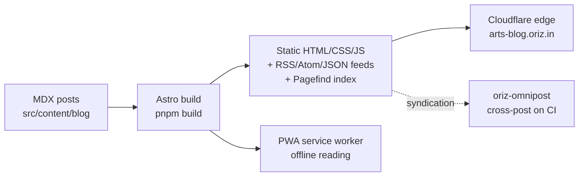

# The Maker's Bench

> Long-form writing for makers — hand-lettering, daily sketch habits, and turning craft into income. Notes from the workbench, not the gallery.

[](./LICENSE)
[](https://github.com/chirag127/oriz-blog-arts/stargazers)
[](https://github.com/chirag127/oriz-blog-arts/commits)
[](https://astro.build)

## What it is

**The Maker's Bench** is the arts vertical of the oriz blog family — practical, craft-first writing for people who make things by hand: lettering, sketching, and building a small creative income. It's a static Astro site with its own bespoke identity (cyanotype indigo on unbleached linen, madder-rose + raw-ochre accents, a pigment-swatch signature), deliberately un-SaaS.

- **Live site:** https://arts-blog.oriz.in
- **GitHub Pages:** https://chirag127.github.io/oriz-blog-arts/
- **Repo:** https://github.com/chirag127/oriz-blog-arts

⭐ If this is useful, please star the repo — it helps others find it.

## How it works



Content is authored as MDX, Astro builds it to a fully static bundle at the edge, and Cloudflare (free tier) serves it globally. Search is client-side via Pagefind; feeds and a PWA service worker are generated at build time.

## Features

- MDX content collection with typed frontmatter (`src/content.config.ts`)
- Bespoke "Maker's Bench" visual identity — Fraunces + Newsreader + Space Grotesk
- Pagefind full-text search (client-side, no server)
- RSS / Atom / JSON feeds + sitemap
- KaTeX math, expressive-code code blocks, reading time
- Installable PWA with offline reading (vite-plugin-pwa)
- i18n scaffolding, light / dark / high-contrast themes

## Tech stack

Astro 6 (static output) · TypeScript · Tailwind CSS v4 · MDX · React 19 islands · astro-expressive-code · Pagefind · KaTeX · vite-plugin-pwa · Biome (lint/format) · Vitest + Playwright (tests) · Wrangler (Cloudflare deploy).

## Repo structure

```
oriz-blog-arts/
├── astro.config.mjs        # site URL, integrations, PWA, redirects
├── src/
│   ├── content/blog/       # MDX posts (the actual writing)
│   ├── content.config.ts   # frontmatter schema
│   ├── pages/              # routes (index, blog, tags, search…)
│   ├── layouts/            # page + post shells
│   ├── components/         # UI islands + chrome
│   ├── styles/             # tokens.css + global.css (the identity)
│   ├── lib/ · data/ · i18n/
│   └── __tests__/          # unit tests
├── docs/index.html         # GitHub Pages landing → redirects to live site
└── package.json
```

## Screenshots

_Add a screenshot of the live site here (`arts-blog.oriz.in`)._

## Quick start

```bash
pnpm install
pnpm dev        # local dev server
pnpm build      # static build → dist/
pnpm preview    # preview the build
```

Other scripts: `pnpm typecheck` (astro check) · `pnpm lint` (biome) · `pnpm format` · `pnpm test` (vitest) · `pnpm test:e2e` (playwright) · `pnpm deploy` (wrangler).

Posts live in `src/content/blog/*.mdx`; the frontmatter schema is in `src/content.config.ts`.

## Configuration

Environment variables are client-safe `PUBLIC_*` values injected at build time (names + purpose only — never commit values):

| Variable | Purpose |
|---|---|
| `PUBLIC_BASE_PATH` | Base path for the build (defaults to `/`; set for GH Pages sub-path) |
| `PUBLIC_CLERK_PUBLISHABLE_KEY` | Clerk publishable key for optional account features (client-only) |
| `PUBLIC_CF_BEACON_TOKEN` | Cloudflare Web Analytics (cookieless) |

Reading the blog never requires an account. Secrets live in the vault/deployment env, never in the repo.

## Part of the oriz family

One of ~80 sites in the [oriz](https://blog.oriz.in) family — a fleet of static, edge-hosted content sites sharing framework-agnostic `@chirag127/*` packages while each keeps its own subject-led identity.

**$0 on Cloudflare's free tier** — static output, no server.

## Contributing

Issues and PRs welcome. Keep changes minimal and conventional. Reading routes stay public and account-free.

## License

[MIT](./LICENSE) © Chirag Singhal · chirag@oriz.in

## Status

Live / production. Roadmap: more maker guides, richer galleries, expanded taxonomy.

_Conventional commits are the changelog._
